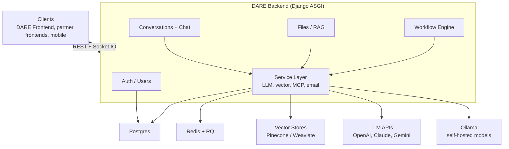

# DARE Backend

[](LICENSE)
[](https://www.python.org/)

> Django REST + Socket.IO backend for **DARE** — the Dietrich Analysis Research Education Platform.

## Table of Contents

- [What is DARE?](#what-is-dare)
- [Overview](#overview)
- [Quick Start](#quick-start)
- [Documentation](#documentation)
- [Tech Stack](#tech-stack)
- [What is included in this repo?](#what-is-included-in-this-repo)
- [What is not included in this repo?](#what-is-not-included-in-this-repo)
- [Stay in touch](#stay-in-touch)
- [Acknowledgements](#acknowledgements)
- [Contributors](#contributors)
- [License](#license)

## What is DARE?

DARE (Dietrich Analysis Research Education Platform) is an open-source, multi-LLM research and
conversation platform. It provides a single, vendor-agnostic interface to OpenAI, Anthropic Claude,
Google Gemini, and self-hosted LLaMA models, with file-grounded retrieval (RAG), Model Context
Protocol (MCP) tool integration, visual multi-step workflows, and real-time streaming. DARE is
built for researchers and institutions that need more than a chatbot — document intelligence,
reproducible workflows, and per-user usage tracking in one place.

**This repository is the DARE backend** — the Django ASGI service that powers the platform. It
handles:

- Real-time streaming chat across providers
- Document upload, processing, and RAG over vector stores (Pinecone, Weaviate)
- Multi-step AI workflow execution via a visual DAG builder
- Token usage tracking and per-user billing
- Access-code based registration for institutional deployments
- Inter-service authentication for partner platforms (e.g. SocraticBooks)

> **DARE runs standalone.** The DARE backend and frontend are all you need to run the platform —
> nothing else is required. SocraticBooks is a separate, optional platform built on top of DARE.

## Overview



See [docs/architecture.md](docs/architecture.md) for the full diagram and
[docs/architecture/overview.md](docs/architecture/overview.md) for component-level detail.

## Quick Start

### Docker

```bash
# 1. Clone
git clone <repo-url> dare-backend && cd dare-backend

# 2. Configure
cp .example.env .env
# Edit .env. At minimum, set DJANGO_SECRET_KEY and one provider key
# such as OPENAI_API_KEY, CLAUDE_API_KEY, or GEMINI_API_KEY.

# 3. Build and start the backend stack
docker compose up --build -d

# 4. Create an admin user
docker compose exec web python manage.py createsuperuser

# 5. Check health
docker compose ps
curl http://localhost:8000/api/health/
curl http://localhost:8000/api/ready/
```

The API will be available at `http://localhost:8000/`. The OpenAPI schema is served at
`http://localhost:8000/api/schema/`. Swagger UI is routed at `http://localhost:8000/api/docs/`, but
it loads Swagger assets from a CDN, so use the raw schema if the UI does not render in an offline or
restricted network.

Docker Compose starts the API server, RQ worker, Postgres + pgvector, Redis, and Weaviate. Optional
Ollama and Weaviate console services are available through Compose profiles. See
[INSTALL.md](INSTALL.md) for details.

### Local Python

Use this path when you want the Django process running directly on your machine.

```bash
cp .example.env .env
python3.13 -m venv .venv
source .venv/bin/activate
pip install -r requirements/local.txt
python manage.py migrate
uvicorn dare.asgi:application --host 0.0.0.0 --port 8000 --reload
```

In a second terminal, start a worker:

```bash
source .venv/bin/activate
OBJC_DISABLE_INITIALIZE_FORK_SAFETY=YES python -Wd manage.py rqworker default -v 3
```

Redis must be running for Socket.IO pub/sub and background jobs. See [INSTALL.md](INSTALL.md) for
complete Docker, local, and production guidance.

## Documentation

| Doc                                                                                          | What's in it                                                    |
| -------------------------------------------------------------------------------------------- | --------------------------------------------------------------- |
| [INSTALL.md](INSTALL.md)                                                                     | Full deployment guide — Docker and bare metal                   |
| [docs/configuration.md](docs/configuration.md)                                               | Every environment variable, with type, default, and description |
| [docs/architecture.md](docs/architecture.md)                                                 | Component diagram and request flows                             |
| [docs/admin-guide.md](docs/admin-guide.md)                                                   | User/role management, access codes, analytics                   |
| [CONTRIBUTING.md](CONTRIBUTING.md)                                                           | Issues, pull requests, coding standards                         |
| [CHANGELOG.md](CHANGELOG.md)                                                                 | Release notes                                                   |
| [SECURITY.md](SECURITY.md)                                                                   | Vulnerability disclosure process                                |
| [docs/integration/socraticbooks-dare-proxy.md](docs/integration/socraticbooks-dare-proxy.md) | DARE/SocraticBooks integration contract and update rules        |
| [docs/architecture/socketio-events.md](docs/architecture/socketio-events.md)                 | Socket.IO event reference                                       |
| [docs/api/dare-backend.md](docs/api/dare-backend.md)                                         | REST API reference                                              |
| [docs/code-standards.md](docs/code-standards.md)                                             | Coding conventions                                              |

## Tech Stack

- **Python 3.13**, Django 5.1, Django REST Framework
- **Django Channels** + python-socketio for real-time streaming
- **Django RQ** + Redis for background jobs
- **PostgreSQL** (production) / SQLite (local dev)
- **Weaviate** and **Pinecone** for vector storage
- **Ollama** for self-hosted LLaMA models

## What is included in this repo?

- Django apps for auth/users, conversations + chat, files/RAG, and the workflow engine
- `core/services/` — the service layer (LLM providers, vector stores, MCP, email)
- `docs/` — architecture, configuration, admin, API reference, deployment, and integration guides
- Docker Compose stack (API, RQ worker, Postgres + pgvector, Redis, Weaviate) and `requirements/`
- Supporting docs — `INSTALL.md`, `CONTRIBUTING.md`, `CHANGELOG.md`, `SECURITY.md`, `BRAND.md`

## What is not included in this repo?

- [dare-frontend](../dare-frontend/) — the React/TypeScript web client (run it separately)
- [socraticbooks-backend](../../socraticbooks/socraticbooks-backend/) and
  [socraticbooks-react](../../socraticbooks/socraticbooks-react/) — the SocraticBooks platform that
  proxies to DARE
- External infrastructure you provide yourself — LLM provider API keys, an Ollama host for
  self-hosted models, and managed Postgres/Redis/vector-store instances in production

## Stay in touch

- **Found a bug or have a feature request?** Open an issue on the project's GitHub repository.
- **Questions or general inquiries?** Email the project team at vks@andrew.cmu.edu.
- **Security disclosures:** see [SECURITY.md](SECURITY.md).

## Acknowledgements

DARE is developed at the Dietrich College of Humanities and Social Sciences, Carnegie Mellon University.

"DARE" (Dietrich Analysis Research Education Platform) and "SocraticBots" are trademarks of Carnegie
Mellon University. See [BRAND.md](BRAND.md) for the brand usage policy. For trademark, licensing, or
general inquiries, contact the project team at vks@andrew.cmu.edu.

This software integrates with third-party APIs (Anthropic, OpenAI, Google, and others); use of those
APIs is subject to each provider's own Terms of Service.

## Contributors

DARE is built and maintained by the team at the Dietrich College of Humanities and Social Sciences,
Carnegie Mellon University.

**Creators**

<table>
  <tr>
    <td align="center" valign="top" width="33.33%"><br /><sub><b>Sayeed Choudhury</b></sub><br />Creator</td>
    <td align="center" valign="top" width="33.33%"><br /><sub><b>Vincent Sha</b></sub><br />Creator</td>
    <td align="center" valign="top" width="33.33%"><br /><sub><b>George Cann</b></sub><br />Creator</td>
  </tr>
</table>

**Team**

<table>
  <tr>
    <td align="center" valign="top" width="33.33%"><br /><sub><b>Carl Skipper</b></sub><br />Contributor</td>
    <td align="center" valign="top" width="33.33%"><br /><sub><b>Muhammad Abdurrehman</b></sub><br />Team Lead</td>
    <td align="center" valign="top" width="33.33%"><br /><sub><b>Brian Wingenroth</b></sub><br />Developer</td>
  </tr>
  <tr>
    <td align="center" valign="top" width="33.33%"><br /><sub><b>Farhat Abbas</b></sub><br />Developer</td>
    <td align="center" valign="top" width="33.33%"><br /><sub><b>Hariss M.</b></sub><br />Developer</td>
    <td align="center" valign="top" width="33.33%"><br /><sub><b>Eira Khan</b></sub><br />QA</td>
  </tr>
</table>

## License

This project is licensed under the [GNU Affero General Public License v3.0](LICENSE) (AGPL-3.0-only).

See the [LICENSE](LICENSE) file for the full license text, or visit <https://www.gnu.org/licenses/agpl-3.0.en.html>.
