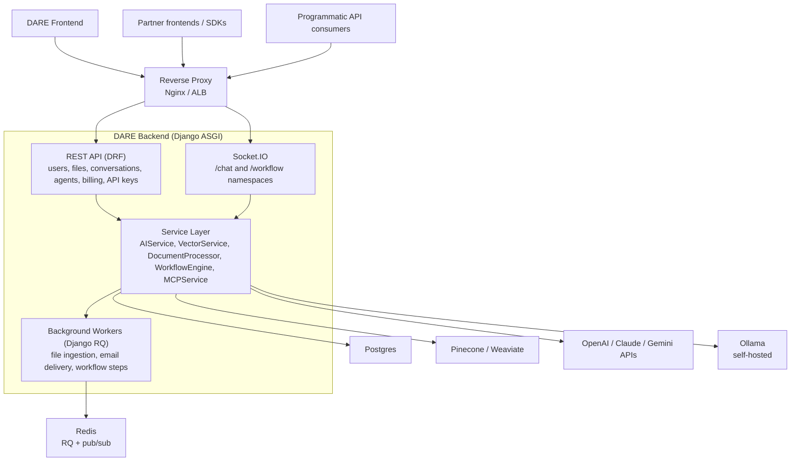

# DARE Backend — Architecture

This document is the entry point for understanding how the backend is structured. For deeper component-level coverage, see [architecture/overview.md](architecture/overview.md). For real-time event contracts, see [architecture/socketio-events.md](architecture/socketio-events.md). For end-to-end request flows, see [architecture/data-flows.md](architecture/data-flows.md).

## Component Diagram



## Key Components

| Component | Responsibility | Code path |
|---|---|---|
| **REST API** | CRUD over conversations, files, prompts, users, billing | `*/views.py`, `*/serializers.py`, `*/urls.py` |
| **Socket.IO server** | Real-time chat streaming + workflow execution updates | `dare/socketio.py`, `conversations/consumers/`, `workflows/` |
| **Service layer** | All third-party integration logic | `core/services/` |
| **Background workers** | Asynchronous file processing, email, embedding | `*/tasks.py`, run via `python manage.py rqworker` |
| **Models** | Domain data (users, conversations, files, workflows, billing) | `*/models.py`, `common/models.py` for mixins |
| **Settings** | Layered settings (common → local/staging/production) | `config/settings/`, `config/env.py` |

## Request Flows

### Authenticated REST request

```
Client → Nginx → Uvicorn → Django middleware →
  DRF authentication (JWT) → ViewSet → Serializer → Model →
  Postgres → Response
```

### Streaming chat

```
Client opens Socket.IO connection on /chat namespace →
  Auth handshake (JWT) → Conversation lookup →
  Client sends user message →
  Server streams LLM response via async generator →
  Server persists final message + token usage →
  Client receives final-event with message_id
```

See [architecture/socketio-events.md](architecture/socketio-events.md) for the full event reference.

### File upload + RAG

```
Client POSTs file → File saved with status=PROCESSING →
  Background job enqueued → Worker picks up →
  DocumentProcessor chunks + embeds → VectorService writes to Pinecone/Weaviate →
  File status=COMPLETED → Subsequent chat queries can RAG against this file
```

### Workflow execution

```
Client builds DAG in frontend → Saves workflow via REST →
  Client triggers run via /workflow Socket.IO namespace →
  WorkflowEngine resolves dependencies, executes step-by-step →
  Each step's output streamed back to client →
  Final artifacts persisted
```

## Key Design Patterns

- **Service layer over fat models** — Models stay thin; business logic that touches third parties or coordinates multiple models lives in `core/services/`.
- **Abstract base classes for swappable providers** — `AIService`, `VectorService` define the interface; concrete subclasses implement per provider. Selection happens via factory functions (`get_vector_service()`, etc.).
- **Soft deletes + active managers** — `BaseModel` provides `is_active` and `is_deleted`; queries use `Model.active_objects` for the default filtered view.
- **Background jobs via `@job` decorator** — Anything blocking, slow, or external goes through Django RQ. The web process never makes synchronous LLM calls.
- **camelCase boundary** — REST responses are camelCase (handled by `djangorestframework-camel-case`); Python code stays snake_case. See [serialization.md](serialization.md).

## Further reading

- [architecture/overview.md](architecture/overview.md) — full component breakdown
- [architecture/data-flows.md](architecture/data-flows.md) — sequence diagrams
- [architecture/socketio-events.md](architecture/socketio-events.md) — real-time event reference
- [api/dare-backend.md](api/dare-backend.md) — REST API reference
