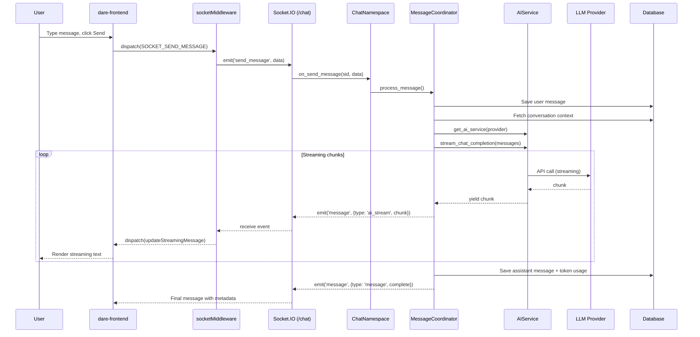
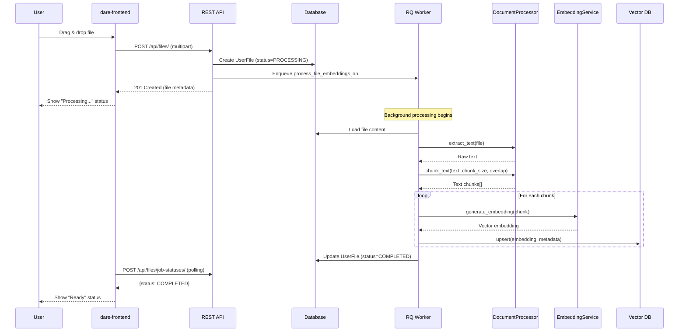
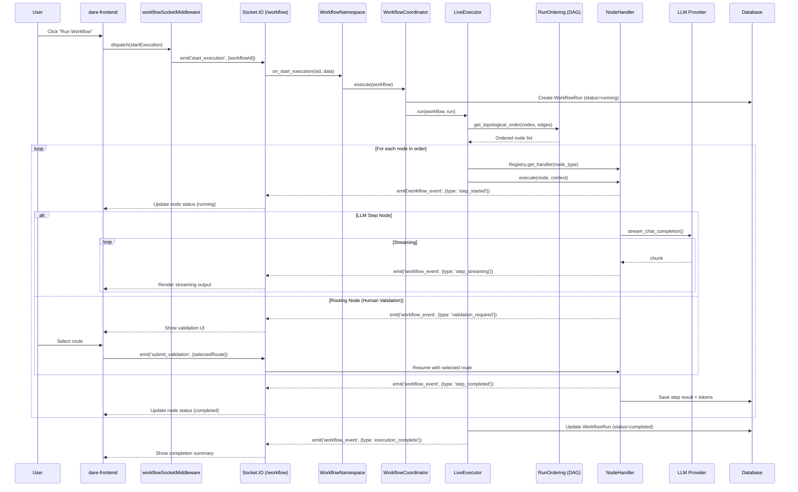
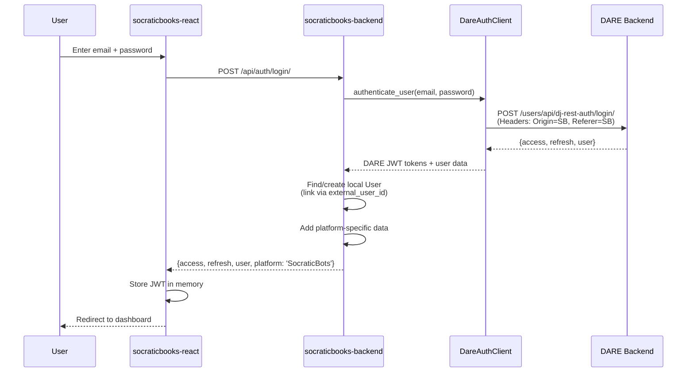
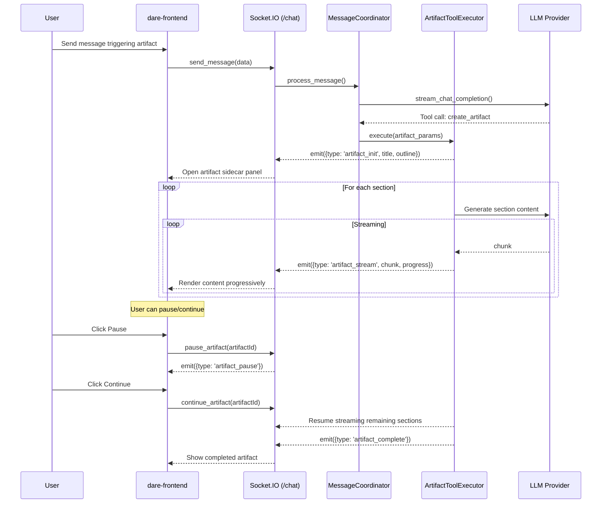

# Data Flows

Key user flows through the DARE platform with detailed step-by-step breakdowns.

## 1. Chat Message Flow

When a user sends a message in a conversation:

**Key services involved:**
- `conversations/namespaces/chat.py` — Socket.IO event handler
- `conversations/services/message_coordinator.py` — Orchestrates the full flow
- `conversations/services/websocket_response_service.py` — Formats and emits events
- `core/services/llm_service.py` → provider implementation — LLM streaming

## 2. File Upload & RAG Processing

When a user uploads a file for use as conversation context:

**Key services involved:**
- `files/api/views.py` — Upload endpoint
- `core/services/file_processor.py` — Background processing pipeline
- `core/services/document_processor.py` — Text extraction and chunking
- `core/services/embedding_service.py` — Vector embedding generation
- `core/services/vector_service.py` — Pinecone/Weaviate storage

## 3. Workflow Execution

When a user runs a multi-step workflow:

**Key services involved:**
- `conversations/namespaces/workflow.py` — Socket.IO event handler
- `workflows/services/workflow_coordinator.py` — Entry point facade
- `workflows/services/live_executor.py` — Full execution engine
- `workflows/services/single_step_executor.py` — Manual mode (one node at a time)
- `workflows/services/batch_executor.py` — Batch file execution
- `workflows/services/run_ordering.py` — DAG topological sort
- `workflows/handlers/registry.py` — Node handler lookup by type

## 4. SocraticBooks Authentication Flow

When a user logs in through the Socratic Books platform:

**Two auth modes exist:**
- **Bearer JWT** — For user-authenticated requests (SB passes the DARE-issued JWT)
- **X-Internal-Key** — For service-to-service calls without user context (file uploads from webhooks, role management)

## 5. Artifact Generation Flow

When the AI generates a long-form artifact (document, code, etc.):

