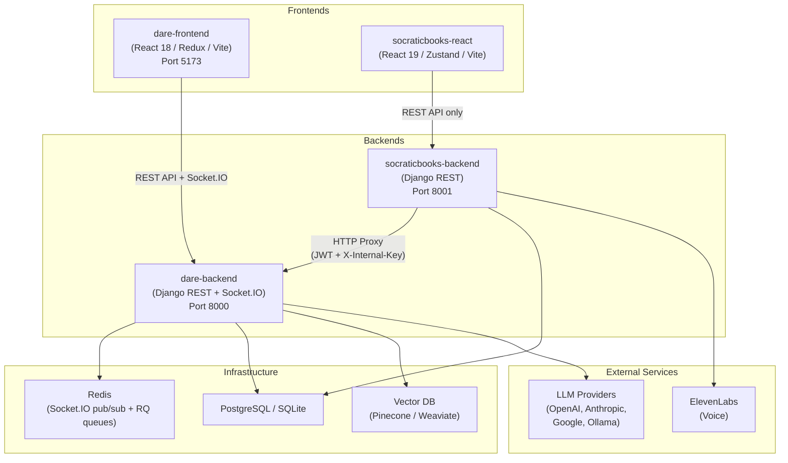
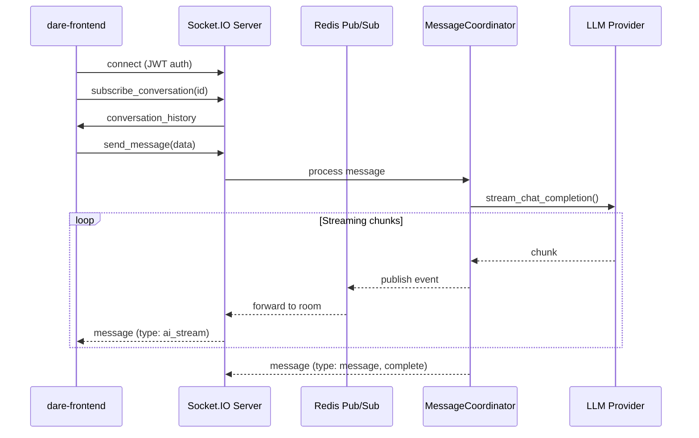
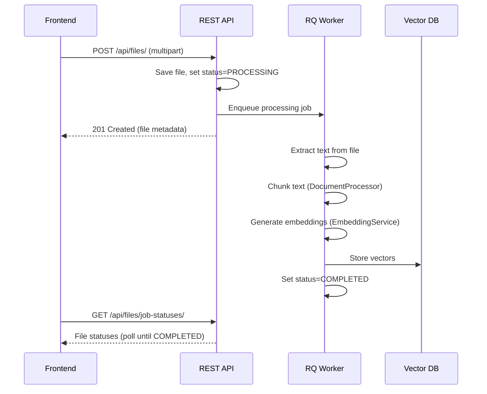
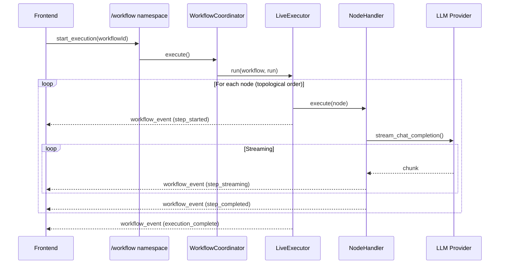
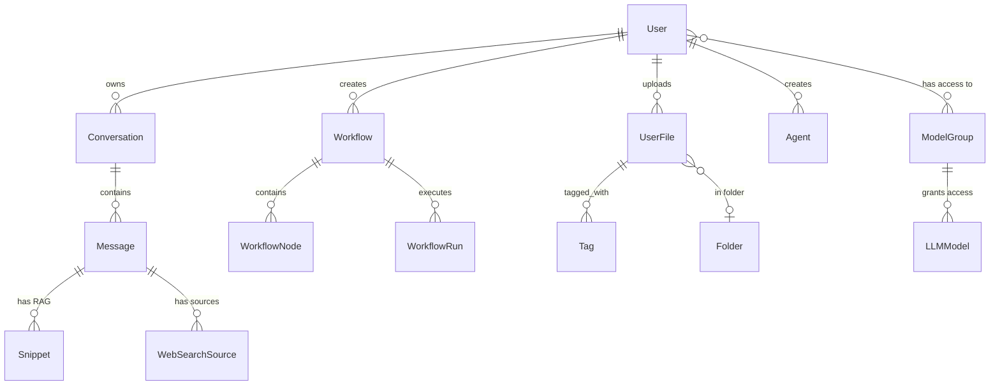
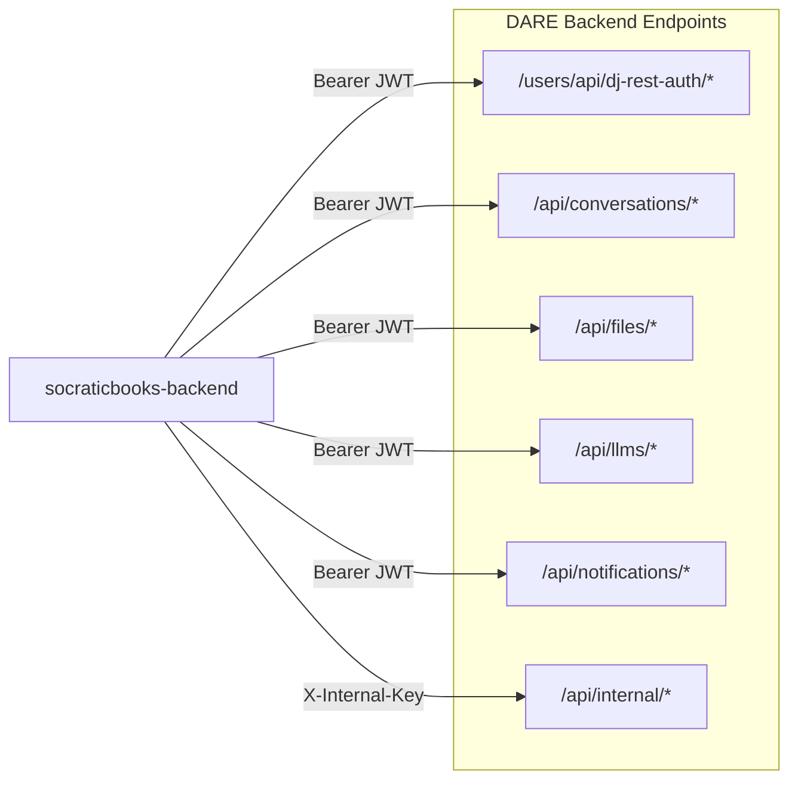

# Architecture Overview

## System Architecture

The DARE platform is a monorepo with four projects that work together:



## Component Responsibilities

### dare-backend (Primary Backend)

The central service that handles all AI, auth, and data operations:

- **Authentication**: JWT-based auth via `dj-rest-auth` + `allauth`
- **Conversations**: Real-time chat streaming via Socket.IO (`/chat` namespace)
- **Workflows**: Visual DAG execution engine via Socket.IO (`/workflow` namespace)
- **File Processing**: Upload, chunk, embed, and index files for RAG
- **LLM Integration**: Multi-provider support (OpenAI, Anthropic, Google, Ollama) via `AIService` ABC
- **Vector Search**: Similarity search against Pinecone or Weaviate
- **Background Tasks**: File processing, embedding generation via Django RQ
- **MCP**: Model Context Protocol server integration
- **Billing**: Token usage tracking and cost calculation

**Key architectural choices:**
- Socket.IO over Django Channels for real-time (python-socketio, not channels consumers)
- ASGI via `uvicorn` (required for Socket.IO)
- Service layer with ABCs and factory functions for extensibility
- Redis-backed Socket.IO manager for multi-process pub/sub

### dare-frontend (Primary Frontend)

React SPA that connects to dare-backend via REST and Socket.IO:

- **Redux Toolkit** for all state management
- **Two Socket.IO middlewares**: one for `/chat`, one for `/workflow`
- **Zod schemas** validate all incoming workflow socket events
- **Shadcn/ui** (Radix UI) component library with Tailwind CSS
- **Formik + Yup** for form validation

### socraticbooks-backend (Educational Proxy)

Thin Django layer focused on educational features, delegates core operations to dare-backend:

- **Proxy pattern**: `DareApiClient` forwards auth, conversations, files, and model requests to dare-backend
- **Two auth modes**: JWT (user-authenticated) and `X-Internal-Key` (service-to-service)
- **Educational models**: Book, Chapter, Note, BotGroup, AccessCode
- **Voice features**: ElevenLabs integration for voice-based learning

### socraticbooks-react (Educational Frontend)

React SPA for the Socratic Books platform:

- **Zustand** for state management (not Redux)
- **TanStack Query** for server state and caching
- **React Hook Form + Zod** for form validation
- Connects exclusively to socraticbooks-backend (no direct DARE connection)

## Real-Time Architecture

The platform uses **python-socketio** (not Django Channels) for all real-time communication:



**Two namespaces:**
- `/chat` — Conversations, messages, artifacts, voice input
- `/workflow` — Workflow execution, step streaming, batch processing, human validation

See [Socket.IO Event Contract](socketio-events.md) for the complete event reference.

## Data Flow: File Upload & RAG



## Data Flow: Workflow Execution



## Service Layer

All LLM calls go through an abstract service layer:

```
get_ai_service(provider) → AIService implementation
    ├── OpenAIService      (GPT-4, GPT-4o, etc.)
    ├── ClaudeService      (Claude 3.5, Claude 3, etc.)
    ├── GeminiService      (Gemini Pro, etc.)
    ├── LlamaService       (Ollama local models)
    └── CustomLLMService   (Custom endpoints)
```

Vector database access follows the same pattern:

```
get_vector_service(provider) → BaseVectorService implementation
    ├── PineconeVectorService
    └── WeaviateVectorService
```

## Database Models (Key Relationships)



## Inter-Service Communication

See [SocraticBooks-DARE Proxy Contract](../integration/socraticbooks-dare-proxy.md) for the complete reference.


