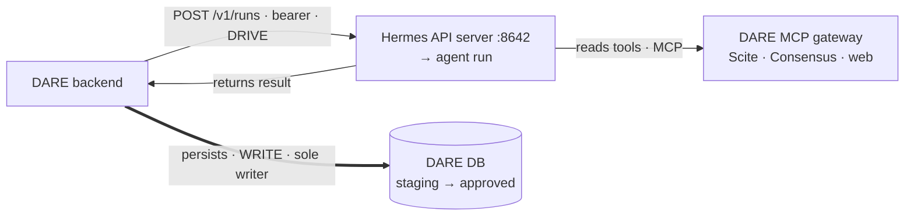
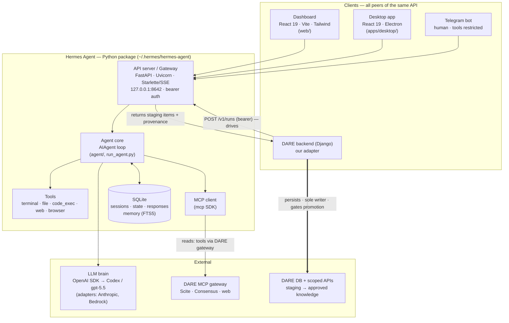
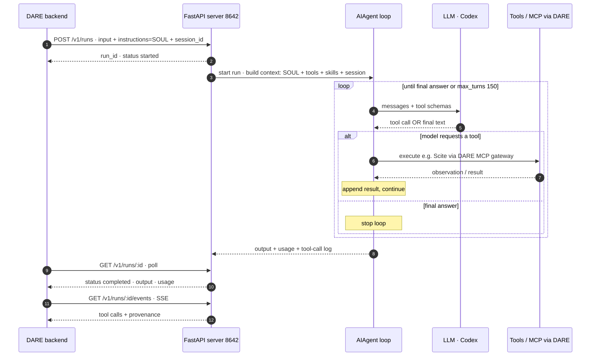
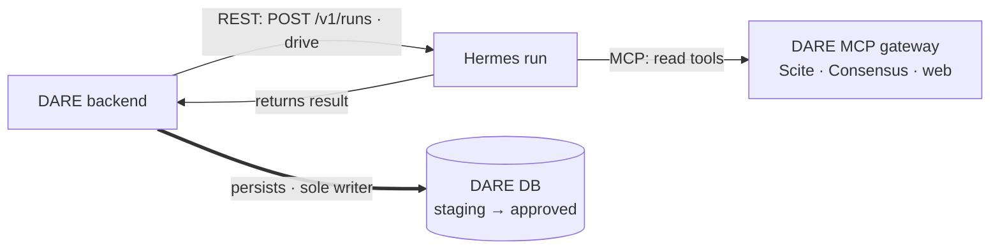
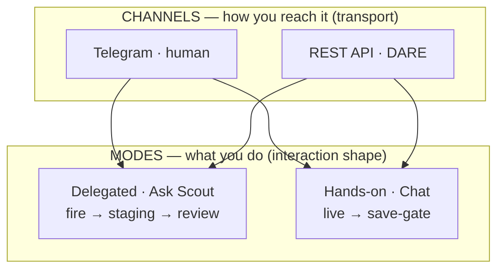
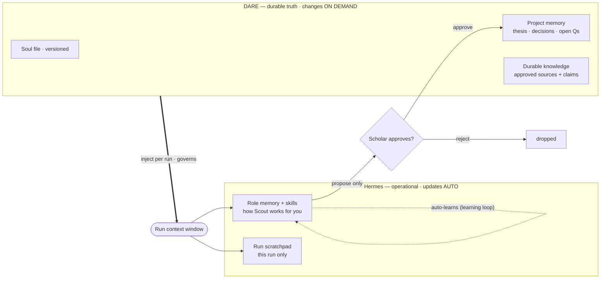
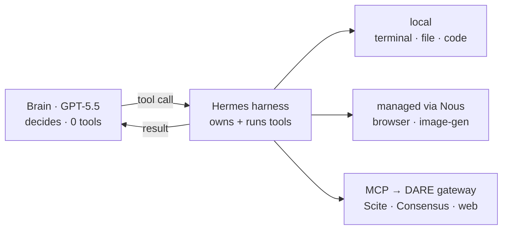
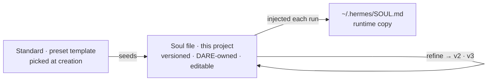

# Hermes Operations Reference — CLI Commands & REST API (DARE Integration)

> Purpose: a self-contained reference of the **Hermes CLI commands** and **REST API
> endpoints** DARE uses to operate Hermes and to integrate it as the delegated
> research-agent runtime for Research Mode.
>
> **Implementation status:** this began as the design base *before* Research Mode
> was built; the architecture below held, and the feature is now **implemented and
> running**. For the as-shipped picture, read alongside the companion docs in this
> repo:
> - `../deployment/research-mode-hermes.md` — set up & deploy Hermes (install → brain → API server → tool scoping → MCP gateway → smoke test)
> - `research-mode-future-enhancements.md` — the roadmap (memory upgrades first)
> - `CHANGELOG-research-mode.md` — what shipped, in order
>
> The CLI/REST surface below was **verified against a live install (Hermes Agent
> v0.15.1)** and exercised end-to-end through the Research Mode build (June 2026).
> Re-verify against the running server if versions drift.

---

## 0. Where this sits in the architecture (the one mental model)



> **MCP to read · REST to drive · DARE to write · webhook is the doorbell.**

- **API server (`:8642`) = the integration seam.** It is how *programs* (DARE) drive
  Hermes. It is **not a website** — `GET /v1` returns 404; endpoints serve JSON to
  authenticated callers, not HTML.
- **Telegram = the human entry point** (chatting from a phone). Optional, not used by DARE.
- **Invariant:** DARE owns durable truth (projects, soul files + versions, sources,
  staging, approved knowledge, audit). Hermes is the execution runtime. Hermes writes to
  **staging only**; the scholar promotes to durable knowledge.
- **Soul files are injected per run** (see §5/§6), not stored/edited via the API.

### Internal packaging & how DARE communicates with it

**Tech stack at a glance:** Frontend = **React 19 + Vite + Tailwind v4** (two apps: the
`web/` dashboard and the `apps/desktop/` Electron app). Backend/core = **Python** (`uv`-managed,
3.11–3.13). The REST surface is **FastAPI + Uvicorn + Starlette** (SSE via `sse-starlette`).
The brain is reached through the **OpenAI SDK** (OpenAI-compatible endpoints for Codex / Nous /
OpenRouter, with native adapters for Anthropic + AWS Bedrock). Tools/MCP via the official
**`mcp`** SDK. Storage is **SQLite** (sessions / state / responses + FTS5 memory). Browser
automation via **Node.js + Playwright/Chromium**. The key point: Hermes is **not a monolithic
server** — it's a Python package with several entry points; the FastAPI server is just the one
that exposes the REST API. **DARE is simply another peer of that API, exactly like the dashboard.**



### The agent core — the AIAgent loop (the runner)

The "core" is **not the FastAPI server itself** — it's the provider-agnostic **`AIAgent` loop**
(`agent/`, `run_agent.py`). The FastAPI server is just *one entry point* that invokes that shared
loop (so do the CLI, desktop app, batch runner, and ACP adapter). The loop is a classic
**think → act → observe** cycle: ask the LLM; if it requests a tool, execute the tool, feed the
result back, and repeat until the model returns a final answer (or hits `max_turns`, currently 150).



---

## 1. Current local environment snapshot (ground truth as of 2026-06-05)

| Thing | Value |
|---|---|
| Version | Hermes Agent **v0.15.1** |
| Home dir | `~/.hermes/` (the `default` profile **is** this dir) |
| Brain | **gpt-5.5** via **openai-codex** (personal Codex sub — spike only; prod must use a client-paid API key) |
| Terminal backend | `local` (runs on the host with user perms) |
| API server | **enabled**, `http://127.0.0.1:8642`, bearer key `dev-spike-local` (set in `~/.hermes/.env`) |
| Gateway service | launchd `ai.hermes.gateway` — `RunAtLoad=true`, `KeepAlive=true` (auto-starts on boot, self-restarts) |
| Telegram | configured; **`terminal`, `code_execution`, `file` tools disabled on this platform** (safety) |
| Bedrock | **disabled** (`bedrock.discovery.enabled=false`) — the machine's `~/.aws` `[default]` profile is a CLIENT account (`kristo-baricevic @ 666109694847`); do not use |
| Baseline cost | ~**14.6k input tokens per run** (Hermes prepends SOUL + tool guidance + skills index) |

Config: `~/.hermes/config.yaml` · API keys/secrets: `~/.hermes/.env` · Soul: `~/.hermes/SOUL.md`
· Memory: `~/.hermes/memories/` (`MEMORY.md`/`USER.md` created on first write) · Skills: `~/.hermes/skills/`

### 1.1 Files in `~/.hermes/` — what each is

**Maps to our memory model (the ones that matter):**
| Path | What it is | Note |
|---|---|---|
| `SOUL.md` | Standards / persona (the soul file) | ships as a **default template** (commented examples = inactive); edit + Save to activate, loaded fresh each message |
| `memories/MEMORY.md` | Agent's curated long-term memory | **created on first write** — empty until the agent remembers something |
| `memories/USER.md` | The agent's model of you | created on first write; fills in over sessions |
| `skills/` | Procedural memory — reusable SKILL.md folders (~74) | populated |

**Plumbing (recognize, don't manage):**
- Operational state: `sessions/` · `state.db` · `response_store.db` (for `/v1/responses` chaining) · `kanban.db` · `cron/`
- Config & secrets: `config.yaml` (+ `.bak`) · `.env` · `auth.json` (pooled creds) · `channel_directory.json`
- Service runtime: `gateway.pid` / `gateway.lock` / `gateway_state.json` · `logs/` · `hooks/` · `plugins/` · `sandboxes/`
- Caches (ignore): `image_cache/` · `audio_cache/` · `context_length_cache.yaml` · `models_dev_cache.json`

For DARE only `SOUL.md` + `memories/` + `skills/` map to the memory model (§9.5–9.7); the rest is runtime plumbing. **Each profile gets its own full set** of these.

---

## 2. Common CLI commands (with use cases)

### Chat / run
| Command | Use case |
|---|---|
| `hermes` | Interactive chat (CLI) |
| `hermes --tui` | Polished terminal UI — zero setup, nicer than plain CLI |
| `hermes -z "prompt"` | **One-shot, non-interactive** — quick Qs, scripts |
| `hermes -c` / `hermes --continue` | Resume last session |
| `hermes --resume <session>` | Resume a specific session |
| `hermes -m <model> --provider <p>` | Override the brain for one run |
| `hermes --yolo` | Auto-approve tool calls — **avoid** (bypasses the approval gate) |
| `hermes --worktree` | Run inside an isolated git worktree |

### Config / model / auth
| Command | Use case |
|---|---|
| `hermes status` | Health of all components |
| `hermes config` / `config edit` / `config set <k> <v>` | View / edit configuration |
| `hermes model` | Switch model/provider |
| `hermes setup` (`setup model` / `terminal` / `gateway` / `tools`) | Re-run wizard / targeted setup |
| `hermes auth` | Manage pooled provider credentials |
| `hermes login` / `logout` | Provider auth |
| `hermes doctor` / `doctor --fix` | Diagnose + auto-fix config/deps |

### Service / messaging (the always-on part)
| Command | Use case |
|---|---|
| `hermes gateway status` | Is the background service running? |
| `hermes gateway start` / `stop` / `restart` | Control the service |
| `hermes gateway run` | Run gateway in foreground (on demand, no service) |
| `hermes gateway install` / `uninstall` | Add / remove the launchd auto-start service |
| `hermes send ...` | Push a message TO Telegram from CLI/cron/scripts |
| `hermes logs` / `tail -f ~/.hermes/logs/gateway.log` | View logs |

### Sessions / skills / cost / tools
| Command | Use case |
|---|---|
| `hermes sessions list` / `export` / `delete` | Manage session history |
| `hermes skills` | Search/install/manage skills (procedural memory) |
| `hermes insights` | Usage + cost analytics |
| `hermes prompt-size` | Byte breakdown of the system prompt (explains the ~14.6k baseline) |
| `hermes tools disable --platform <p> <tool...>` | Restrict tools per platform (e.g. Telegram) |
| `hermes tools enable --platform <p> <tool...>` | Re-enable a tool on a platform |

### UI surfaces
| Command | Use case |
|---|---|
| `hermes dashboard` (`:9119`) | Web UI — config, sessions, models, logs (preferred local UI) |
| `hermes dashboard --stop` / `--status` | Stop / inspect the dashboard process |
| `hermes desktop` | Native Electron app (builds on first run) |
| `hermes acp` | Run as Agent Client Protocol server → VS Code / Zed / JetBrains |

### Relevant to the DARE build (later)
| Command | Use case |
|---|---|
| `hermes profile` (`create`/`use`/`export`/`import`/`install`) | Isolated instances. **Heavyweight** — see §7 tenancy note |
| `hermes proxy` | Expose OAuth providers as a local OpenAI-compatible endpoint |
| `hermes mcp` | Manage MCP servers / run Hermes as an MCP server |
| `hermes cron` | Scheduled agent runs |

> Any subcommand supports `--help` (e.g. `hermes sessions --help`).
> Some interactive commands (e.g. `hermes tools` with no subcommand) require a real TTY.

---

## 3. Turning Hermes on / off

The **gateway service** is the only always-on piece (Telegram + API server + cron + kanban).
CLI/TUI/dashboard/desktop run only while open.

```bash
hermes gateway stop        # stop now — RunAtLoad brings it back on next reboot/login
hermes gateway start       # start the installed service
hermes gateway uninstall   # remove launchd service → NO auto-start on boot (run on demand after)
hermes dashboard --stop    # the dashboard is a separate process (:9119)
```

You can always still use `hermes` (chat) without the background service.

---

## 4. REST API reference (verified surface on `:8642`)

**Auth:** every request needs `Authorization: Bearer <API_SERVER_KEY>` (currently `dev-spike-local`).
**Base URL:** `http://127.0.0.1:8642`.

### Run the agent (what the DARE adapter uses)
| Method | Path | Body / params | Returns | Use case |
|---|---|---|---|---|
| `POST` | `/v1/runs` | `{input, instructions, session_id}` | `{run_id, status:"started"}` | **Start an async run** (long Scout/Critic work) |
| `GET` | `/v1/runs/{run_id}` | — | `{status, output, session_id, usage{input/output/total_tokens}, model, ...}` | **Poll** status/result |
| `GET` | `/v1/runs/{run_id}/events` | — (SSE) | tool calls + progress events | **Tool-call provenance** (§11) |
| `POST` | `/v1/runs/{run_id}/stop` | — | — | Cancel a run |
| `POST` | `/v1/responses` | `{input, instructions, store, previous_response_id?, conversation?}` | full `output` array incl. tool calls | Sync-ish; multi-turn chaining |
| `POST` | `/v1/chat/completions` | OpenAI-compatible `{model, messages, stream}` | OpenAI-style completion | For Open WebUI / OpenAI SDK clients |

### Sessions / jobs (management)
| Method | Path | Use case |
|---|---|---|
| `POST` | `/api/sessions/{id}/chat` | One synchronous agent turn in a session |
| `POST` | `/api/sessions/{id}/chat/stream` | SSE stream for a single turn |
| `GET` | `/api/sessions` | List sessions |
| `POST` | `/api/jobs` | Create scheduled/background run (cron) |

### Discovery
| Method | Path | Use case |
|---|---|---|
| `GET` | `/v1/models` | List the served model id (`hermes-agent`) |
| `GET` | `/v1/toolsets` | Enabled tools per toolset |
| `GET` | `/v1/skills` | Available skills |

### ❌ Not available (by design)
`/api/soul`, `/api/config`, `/api/profiles` → **404**. There is **no REST endpoint to edit
`SOUL.md`, config, or profiles** via the gateway API. (The dashboard's "EDIT SOUL.MD"
button is a dashboard-only feature that writes the file directly — not exposed to callers.)

---

## 5. The SOUL.md mechanism (how DARE "sets the soul")

There is no soul-editing endpoint, and that is correct: **DARE must not edit a shared
`SOUL.md`** (concurrent projects would clobber each other; it splits the source of truth).

> **DARE sets the soul by putting the soul-file-version *content* into the `instructions`
> field of each `POST /v1/runs` call.** No separate API call. The soul rides on the request.

This is verified working (a marker planted in `instructions` was echoed back in `output`).
Result: every run carries its exact soul version → provenance for free.

---

## 6. The DARE-side adapter pattern (Django/Python)

```python
import requests, time

HERMES  = "http://127.0.0.1:8642"
HEADERS = {"Authorization": "Bearer dev-spike-local", "Content-Type": "application/json"}

def start_scout_run(soul_file_content: str, task: str, dare_run_id: str) -> str:
    """Delegate a Scout run. Soul injected via `instructions`, task via `input`."""
    r = requests.post(f"{HERMES}/v1/runs", headers=HEADERS, json={
        "input": task,                       # delegated task / researchQuestion
        "instructions": soul_file_content,   # the soul file VERSION for this project/run
        "session_id": dare_run_id,           # your ResearchAgentRun id (correlation)
    })
    r.raise_for_status()
    return r.json()["run_id"]

def wait_for_result(hermes_run_id: str) -> dict:
    while True:
        d = requests.get(f"{HERMES}/v1/runs/{hermes_run_id}", headers=HEADERS).json()
        if d["status"] not in ("started", "running", "queued"):
            return d                          # {status, output, usage, ...}
        time.sleep(3)

# For §11 tool-call provenance, consume the SSE stream:
#   GET /v1/runs/{hermes_run_id}/events   -> tool calls, queries, timings
```

### Contract mapping (`hermes-agentic-harness-setup.md` §10/§11 → endpoints)
| DARE contract field | Where it goes |
|---|---|
| `task` / `researchQuestion` | `input` |
| `soulFileVersion.content` | `instructions` ← the soul mechanism |
| `runId` | `session_id` (correlation back to `ResearchAgentRun`) |
| response `summary` / `output`, `usage` | run summary + cost |
| `toolCalls[]` + provenance | `GET /v1/runs/{id}/events` (SSE), or `/v1/responses` output array |

---

## 7. Architecture notes & gotchas (must-knows before building)

1. **No per-run tool restriction.** The API has no `allowedTools` parameter — the agent
   uses its full configured toolset. So §9/§10 `allowedTools` and the "staging-only"
   invariant **must be enforced at DARE's MCP gateway boundary** (only expose the allowed
   tool) and/or per-profile config — never trusted to the request payload.
2. **`model` is cosmetic.** The brain is set server-side (per profile/`config.yaml`).
   DARE does not pick the model per request. "5 projects = 5 brains" would mean 5 profiles
   on 5 ports, not a per-request field.
3. **No soul/config/profile REST endpoints.** Manage those out-of-band (CLI/dashboard/file)
   — DARE controls the soul via per-run `instructions` only (§5).
4. **A profile is heavyweight, not a tenant row.** Each profile = its own dir + `.env`
   (own port + API key) + `SOUL.md` + memory + skills + DBs + gateway process. **Do not
   auto-spawn a profile per frontend user** on one shared `~/.hermes` box (scaling cliff).
   Recommended tenancy: ONE shared Hermes service; per-project soul injected per run;
   durable per-project state lives in DARE; the isolation boundary is the **per-run scoped
   credential** (user+project+run). Use a real profile only for persistent *operational*
   role-memory, lazily. Schema principle: **Hermes = ephemeral/operational (per-run);
   DARE = durable/truth.** The frontend creates a DARE *project* (DB row), not a profile.
5. **Tools `local` run on the host.** With the `local` terminal backend, `terminal`/
   `code_execution`/`file` execute on the machine with user perms. We disabled those on
   Telegram. For full isolation, `terminal.backend: docker` (costs disk).
6. **Cost.** ~14.6k input tokens baseline per run (big system prompt). Track in DARE's
   cost/audit layer; `hermes prompt-size` shows the breakdown.

---

## 8. Quick verification snippets

```bash
# Is the API up?
curl -s -H "Authorization: Bearer dev-spike-local" http://127.0.0.1:8642/v1/models

# Smoke-test a run end to end (soul injection + poll)
RID=$(curl -s -X POST http://127.0.0.1:8642/v1/runs \
  -H "Authorization: Bearer dev-spike-local" -H "Content-Type: application/json" \
  -d '{"input":"In one sentence, what is a systematic literature review?",
       "instructions":"You are Scout. End your reply with [[SOUL-OK]].",
       "session_id":"smoke-1"}' | python3 -c "import sys,json;print(json.load(sys.stdin)['run_id'])")
curl -s -H "Authorization: Bearer dev-spike-local" http://127.0.0.1:8642/v1/runs/$RID | python3 -m json.tool
```

---

## 9. Architecture decisions — the core meeting answers

The locked answers behind the prototype (decided 2026-06-05). These are exactly the
questions that come up: *how does DARE talk to it, what can it do, how many modes, how are
artifacts made, and what lives where.*

### 9.1 DARE ⇄ Hermes communication — the pattern
Split by direction; never conflate transport with mode:

- **DARE → Hermes:** **REST.** `POST /v1/runs` (+ poll `/v1/runs/{id}`, SSE `/events`). DARE drives.
- **Hermes reads tools:** **MCP**, through DARE's MCP gateway (Scite/Consensus/web). Credentials, provenance and audit stay in DARE.
- **Hermes → DARE writes:** **none directly.** Hermes *returns* structured results (staging items, tool-calls, provenance, memory proposals); **DARE is the sole writer** and persists them. Keeps the invariant intact (Hermes can't touch the record) and yields provenance for free.
- **Webhook:** optional — only the "run done, here's the payload" doorbell. DARE still does the write.
- *Later, gated:* expose DARE as an **MCP server with write-tools** (`stage_finding`, `draft_artifact`) for incremental/streaming writes. Only if needed — it grants write power, so scope it hard.

> **MCP to read · REST to drive · DARE to write · webhook is the doorbell.**



### 9.2 Tools & skills — extent, and what to scope down
The agent core is a real **think → act → observe** loop (Claude-Code / Codex class). Toolbelt:
`terminal` (host shell) · `code_execution` (sandbox) · `web` / browser (Playwright) · `file` ·
**MCP client** · **skills** (procedural memory; ~74).

- **Scout/Critic need almost none of it** — just the **agent loop + MCP client** (→ DARE gateway) + **web search**.
- ⚠️ **Security lever:** scope tools down per profile/role. A research Scout must NOT have `terminal` / `code_execution` / `file` / browser on the host. Enable MCP + web only; disable the rest (as already done for Telegram). With the `local` backend these execute on the machine with user perms → use `terminal.backend: docker` for true isolation.

### 9.3 Two MODES vs two CHANNELS (don't conflate)
- **Modes = interaction shape:** **Delegated** (Ask Scout · `POST /v1/runs` · fire → staging → review) vs **Hands-on** (Chat · `/v1/chat` or `/api/sessions/{id}/chat` · live, present, **save-gate** not staging-gate).
- **Channels = transports:** **Telegram** (human) vs **REST API** (DARE). A channel is not a mode — **both modes ride the REST channel.** Telegram was just where hands-on chat was first tried.



> A channel ≠ a mode. Any channel can carry either mode.

### 9.4 Artifacts (mermaid / charts / SVG)
- **User-initiated**, two entry points: from **Chat** ("draft a figure from these sources") or a **"New artifact"** action in the Artifacts view → runs the **Presentation Assistant** on *approved* knowledge.
- Hermes generates the mermaid/SVG internally and **returns it as a draft**; DARE stores a **draft artifact** (not final); the scholar edits/finalizes (**save-gate**); provenance (which approved sources) is preserved.
- Same rule as everything: **agent drafts, human finalizes.**

### 9.5 Profiles, stores & "active context"
- **1 research workspace = 1 Hermes profile** (per project) for a single scholar's handful of projects — fine, matches the plan. (At many-users scale, prefer per-run injection over auto-spawned profiles — see §7 #4.)
- A profile holds the agent's **operational** memory: `SOUL.md`, skills, session/state DBs — operational, **not** truth.
- The **"active context"** for a run = what **DARE injects per run**: the soul-file *version* (`instructions`) + selected DARE context (sources, approved knowledge, project memory).
- So: **profile = durable operational memory (Hermes-side); active context = per-run truth injected by DARE.** They meet in the run's context window; they stay separate as stores. **DARE owns truth; Hermes stays ~stateless-per-run.**
- **SOUL.md implementation (to finalize):** DARE stores the canonical per-project soul file (versioned) and injects its content via `instructions` each run (§5). Hermes's on-disk `SOUL.md` is not the source of truth and is never edited by DARE.

**Memory model — the three stores, and who can change each:**



> **Down = governance** (DARE injects soul + selected context every run). **Up = proposal** (Hermes can only *suggest*; the scholar promotes). The soul file is **never auto-edited**. DARE stores; Hermes computes.

### 9.6 The thin layer: model vs harness vs tools (who provides what)
Common confusion: *"do all these tools (browser, image-gen, delegation, cron…) come from my Codex subscription?"* **No — they come from Hermes.** Three layers:

1. **The brain (GPT-5.5)** — pure reasoning, text in/out. Provides **zero tools**; it only *decides which tool to call* by emitting a structured tool-call. Executes nothing.
2. **Hermes (the harness)** — owns the toolbelt. Each turn it advertises the tool schemas to the model, then **executes** whatever the model picks (think → act → observe), and manages memory/skills/sessions/cron. **All the capabilities live here**, not in the model. (Same pattern as Claude Code: model decides, harness runs Bash/Edit.)
3. **Tool backends** — local (terminal/file/code-exec/agent loop), external-managed (browser via Browser Use, `image_generate` via FAL — these route through **Nous**, not Codex), or **MCP** (→ DARE's gateway → Scite/Consensus). Each backend has its own auth/cost.

Consequences:
- **`gpt-5.5 (openai-codex)` is not two brains.** GPT-5.5 *is* the model; `openai-codex` is the *route/billing* (the Codex subscription authenticates + pays for GPT-5.5's tokens).
- **Switching the brain to a client-paid API key keeps every tool** — the toolbelt is Hermes's, not the subscription's. Only billing/auth + rate limits change. The spike's power survives productionization.
- A few **managed** tools (browser, image-gen) bill via **Nous**, separate from the brain. DARE's research use needs only a **thin slice** — the agent loop + MCP client (→ our gateway) + web search — not Nous image-gen/managed-browser. Keep the enabled toolset minimal (also the §9.2 security lever).

> **What we're cooking on:** GPT-5.5 brain (via Codex sub) → Hermes harness (owns + runs the tools) → tools (mostly local + MCP-to-DARE; a couple via Nous). DARE wires only loop + MCP + web.



> The brain provides **zero** tools — it only picks. Hermes owns and runs them. Swap the brain (Codex sub → API key) and the toolbelt is unchanged.

### 9.7 Standard vs Soul file vs agent memory (the layer everyone confuses)

| Layer | What it is | Lives in | Changes |
|---|---|---|---|
| **Standard** (wizard preset) | A *template* — a curated starter set of rules for a kind of work (Research Ethics / Empirical Rigor / Blank) | picked at project creation | only by re-picking |
| **Soul file** | The project's *actual, versioned* standards doc the agent obeys; seeded from the Standard, then refined | **DARE** (canonical, versioned); injected per run as `instructions` | scholar edits → new version |
| **Agent memory** | What the agent *learned*: `memories/MEMORY.md`, `memories/USER.md`, `skills/` | **Hermes** (`~/.hermes/`) | auto (learning loop) |

- **`SOUL.md` is NOT agent memory.** SOUL.md = standards (how to behave); `MEMORY.md`/`USER.md`/`skills/` = learned memory (what it picked up). Standards *govern*; memory *accumulates*.
- Hermes's `MEMORY.md` / `USER.md` are created **on first write** — empty until the agent learns something (that's why only `SOUL.md` was visible).
- The wizard **Standard seeds** the project soul file; after that the **soul file** (DARE-owned, versioned) is the source of truth, injected per run → lands as `~/.hermes/SOUL.md` at runtime (a copy).



> Client one-liner: **the Standard is the off-the-shelf template; the Soul file is your filled-in, living, versioned instance the agent is actually governed by.**

### 9.8 How context is loaded per run + the soul-edit pattern (decided)

**What Hermes reads each run (not all raw-dump):**
- `SOUL.md` → **read in full**, prepended to the system prompt every run (main driver of the ~14.6k-token baseline). DARE's injected `instructions` layer on top.
- `skills/` → **lazy**: only a skills *index* (names/descriptions) is loaded; a full `SKILL.md` is pulled in on demand when relevant.
- memory (`MEMORY.md`/`USER.md` + sessions) → **retrieved, not dumped**: SQLite **FTS5 full-text search + LLM summarization** (+ a user-modeling layer). **No vector/embedding search** — it's lexical. Memory scales without blowing up tokens.

**Token model:** the per-run floor is SOUL + tool-guidance + skills-index (~14.6k). Keep the soul file tight; inject only *selected* context (the "memory slice") — don't dump everything.

**Editing the soul from DARE — ONE file, owned by DARE (refined 2026-06-05 after verifying against Nous docs):**

Key fact: `SOUL.md` is **slot #1 of the system prompt and *replaces* the built-in default identity** — the agent is genuinely *anchored* to it. `instructions` on `/v1/runs` is a per-run *overlay* that customizes the prompt **without editing `SOUL.md`**; there is **no REST endpoint to edit `SOUL.md`**. So you cannot reliably "out-shout" a generic SOUL.md with a soft per-run instruction — **make `SOUL.md` itself be DARE's soul file.**

Two planes:
- **Control plane (provisioning):** DARE keeps the **canonical soul file in its own DB (versioned)** and **writes it into the project's profile `SOUL.md`** at project create/edit (bring-your-own or template). This makes DARE's standards the anchor (slot #1). Done via a soul-sync step (file write at the co-located Hermes service / `hermes profile` tooling) — **not** the run REST API.
- **Data plane (per run):** `POST /v1/runs` → `input` = task, `instructions` = per-run framing + soul-file-**version** marker (provenance). Heavy identity lives in `SOUL.md`.

So the "two files" are: **DARE canonical (truth, versioned)** → provisioned into → **profile `SOUL.md` (the anchor the agent obeys)**.
- *Pilot tenancy (per-project profile):* provision `SOUL.md` per profile = best (strong anchor). ← recommended.
- *Shared-profile-at-scale alternative:* keep `SOUL.md` neutral and inject standards via `instructions` per run (weaker anchor, but no per-profile file).
- **Open mechanism to confirm in the spike:** the cleanest way to set a profile's `SOUL.md` programmatically (control-plane), since no REST soul endpoint exists.
- **Product:** the wizard "Standards" step → a **"Soul file"** step (template *or* bring-your-own full `soul.md`: persona + epistemic standards; subagent orchestration = v2). Presets become soul-file templates.

Community best practice (Nous docs): **SOUL.md = durable instance/profile persona; facts & project rules → MEMORY / project-context files (`HERMES.md`/`AGENTS.md`); `/personality` = temporary overlay.**

### 9.9 Profile + SOUL.md provisioning — the verified mechanism

Verified on the live install (v0.15.1) + Nous docs:
- A **named profile = an isolated HERMES_HOME** at `~/.hermes/profiles/<name>/`, each with its own `config.yaml`, `.env`, **`SOUL.md`**, memories, sessions, skills, gateway. (Default profile = `~/.hermes/` itself.)
- **Hermes loads `SOUL.md` only from HERMES_HOME** — never the working dir. So per-project persona = that profile's `SOUL.md`.
- `hermes profile` subcommands: `list · use · create · delete · describe · show · rename · export · import · install (git URL/dir) · update · info`.
- **No REST endpoint sets the soul** → it is a **control-plane file write**.

**DARE provisioning flow (set once, reuse every run):**
1. **Create project** → `hermes profile create proj_<id>` → **write `~/.hermes/profiles/proj_<id>/SOUL.md`** = DARE's canonical soul (bring-your-own or template). One time.
2. **Run** → call that profile's `/v1/runs` with just the **task** (`input`). Hermes uses the profile's `SOUL.md` automatically — **no soul in the request** (kills the per-run-resend overkill).
3. **Edit soul** → overwrite that profile's `SOUL.md` (read **fresh** next run, no restart) + bump DARE's versioned copy.
4. **Version, don't drift-diff** → DARE *is* the writer of `SOUL.md`, so there's no "drift" to chase — a canonical-copy diff of `SOUL.md` adds little. DARE just **owns + versions** it. What's worth observing is the *auto-grown* memory (next bullet).
5. **Bring-your-own** → user uploads `soul.md` in DARE → DARE writes it as the profile `SOUL.md`. (Client requirement: user controls their own soul — satisfied.)

**Agent-memory control (`MEMORY.md`/`USER.md`) — verified endpoints on `:9119` (authed):**
- `GET /api/memory` (read) · `POST /api/memory/reset` (clear) · `PUT /api/memory/provider` (backend). **No fine-grained per-entry edit, no per-profile memory route** — it's read + reset, scoped to the active profile.
- Ownership split: **`SOUL.md` = DARE-owned (write via `PUT …/soul`)** · **`MEMORY.md`/`USER.md` = Hermes-owned, auto-grown.** The agent is guarded from self-editing `SOUL.md`/`config.yaml` (threat-pattern), but it *does* auto-write its own `MEMORY.md`/`USER.md`.

**Editability + rollback — "git for the agent's memory":** REST gives only read + full reset (no per-entry edit). But `MEMORY.md`/`USER.md` are plain markdown files (`~/.hermes/profiles/<name>/memories/`) → **fully editable at the filesystem level** (same control-plane channel as soul). So DARE provides the versioning/rollback Hermes lacks:
1. **Snapshot in** — after each run, DARE reads memory (`GET /api/memory` or file) → stores a timestamped version (audit trail + the frontend "Agent Memory" view).
2. **Prune** — scholar removes/edits an entry in DARE → DARE writes the corrected file back → Hermes re-reads it next run.
3. **Roll back** — restore a prior snapshot by writing it back to the file.
4. **Reset** — `POST /api/memory/reset` (nuclear), then optionally re-seed from a snapshot.

Hermes = working copy (auto-edits); **DARE = version history + restore.** Caveats: needs FS write access (co-located/shared volume/endpoint); sync at **run boundaries** (avoid races with Hermes's auto-curation); keep distinct from DARE's own durable project memory (propose→accept).

**Programmatic write — CORRECTION (verified in source `web_server.py`):** there IS an HTTP endpoint — just on the **dashboard server (`:9119`)**, not the agent API (`:8642`):
- `GET  /api/profiles/{name}/soul` → `{content, exists}` (read — use for the DARE-vs-Hermes **diff**)
- `PUT  /api/profiles/{name}/soul` → body `{ "content": "<soul md>" }` → writes `SOUL.md`, returns `{ok:true}` (this is what the dashboard "EDIT SOUL.MD" button calls)

It is **authenticated** (`GET` returned `401` without creds) → DARE calls it with the dashboard token. Under the hood it's just `soul_path.write_text(content)`.

So DARE has two clean control-plane options to provision/update a profile's `SOUL.md`:
1. **HTTP** via the dashboard: `PUT/GET /api/profiles/{name}/soul` (authed) — no filesystem coupling; needs the dashboard server running.
2. **Direct file write** to `~/.hermes/profiles/{name}/SOUL.md` (if co-located / shared volume).

Integration = two channels: **`:8642 /v1/runs`** (data plane, task) + **soul read/write** (control plane: `:9119` HTTP *or* file). The agent itself is **blocked from editing `SOUL.md`/`config.yaml`** (threat-pattern guard) — it cannot self-modify its standards.

**✅ VERIFIED LIVE (2026-06-08 spike):**
- `POST /v1/runs` (bearer `dev-spike-local`) → poll `/v1/runs/{id}` → `completed` in ~12s; the `instructions` marker came back in `output`; usage = **14,614 input tokens** (the baseline) + 41 output.
- `hermes profile create dare-research` → isolated profile dir (own `SOUL.md`/memories/skills/sessions). **File-write to `<profile>/SOUL.md` + run via `HERMES_HOME=<profile> hermes -z "…"` returned the provisioned soul's marker** → per-profile soul governs with **no per-request injection**.
- **Gotcha:** a fresh profile has **no model/keys** → run fails with `Invalid length for parameter modelId, value: 0`. **Provisioning recipe = `profile create` + copy `config.yaml` + `.env` from the base profile + write `SOUL.md`.** (Or `hermes profile create --clone`, or `<profile> setup`.)

**Full battery verified (same spike):**
- `GET /v1/runs/{id}` returns `{object:"hermes.run", status, output, usage, session_id, model, last_event}`. (Polls can briefly come back empty mid-stream → adapter should retry; `/events` is the robust live channel.)
- **SSE `GET /v1/runs/{id}/events`** emits the §11 provenance stream: `tool.started {tool, preview}` → `tool.completed {tool, duration, error}` → `message.delta {delta}` → `run.completed`. ← DARE parses this for `toolCalls[]`.
- **Tools enabled now:** `web` (web_search/web_extract), `browser`, `terminal`, `file`; **72 skills**. **web_search works** (~4s, cited a real source). **No MCP servers configured** → add Scite/Consensus via `hermes mcp add <name> --url <DARE MCP gateway>`.
- **Hands-on `POST /v1/responses`** (sync): returns OpenAI-style `output: [{type:"message", role:"assistant", content:[{type:"output_text", text:"…"}]}]`; honors `instructions`. → Chat mode.
- Cost: ~14.6k input baseline (no tools); ~30k with web/tool context.

### 9.10 Session lifecycle — what happens when a session ends

- **Persisted, not deleted** (`sessions/`, `state.db`, `response_store.db`). A previous session is archived, not terminated.
- **Resumable:** `hermes -c` (last) · `hermes --resume <id>` · API session endpoints (`/api/sessions`, `/api/sessions/{id}/chat`).
- **Cross-session continuity (without resuming):** a new session gets an **auto-generated summary of recent sessions** (~500–1500 tokens) injected into its system prompt, and past sessions are **FTS5-searchable**. It "knows" prior sessions via summary + search, not by loading them whole.
- **Durable memory** (`MEMORY.md`/`USER.md`) persists across all sessions independently.
- **SOUL.md vs sessions:** re-read **per message** → updating it does **not** require a new session; a running session picks up the change on its next turn.
- **Limits:** per-run `max_turns` 150 · per-session context bounded (summarised/compacted) · no hard cap on stored sessions (recalled via summary/search, not all loaded).
- **For DARE:** map a `ResearchAgentRun` ↔ a Hermes `session_id` (we already pass it). Hermes handles cross-session recall; DARE holds the durable record.

---

## 10. Pilot use cases & how a profile grows (the demo)

Topics being worked through live (the scholar's zone — politics / systems / productivity):
- **Primary — "What Makes the Nordic Model Work"** (Political Economy). Rich literature + genuine *disputing* evidence (welfare-state-caused vs. predates-it) → showcases supporting/disputing + Critic + the soul file's "separate values from evidence."
- **Secondary — "AI Coding Assistants & Developer Flow"** (Software Eng · Productivity). Current, self-referential, dev-comfort topic.
- **(Archived) — "Does Proportional Representation Improve Governance?"** (Political Science).

**How one project's Hermes profile grows over the demo:**

| Stage | `SOUL.md` | `memories/` (`MEMORY.md`, `USER.md`) | sessions | DARE durable |
|---|---|---|---|---|
| Create project | written once (Research-Ethics / bring-your-own) | empty | none | project + sources |
| First Scout run | unchanged (the anchor) | may curate 1 op-memory | session 1; tool calls logged | findings **staged** |
| Review / approve | unchanged | — | — | approved → **Project Knowledge** |
| A few runs in | unchanged | `USER.md` fills (name/prefs); `MEMORY.md` accrues | accumulate → summarised into new sessions | knowledge grows |
| Refine standards | **you edit → v2** (DARE diffs vs on-disk) | unchanged | applies next message | soul-file version bumped |

> The story to show: **you edit `SOUL.md` (your standards) · the agent grows its own `MEMORY.md`/`USER.md` (operational, auto) · sessions accumulate and get summarised · DARE holds the durable approved knowledge** — four layers, each owned by the right party.
